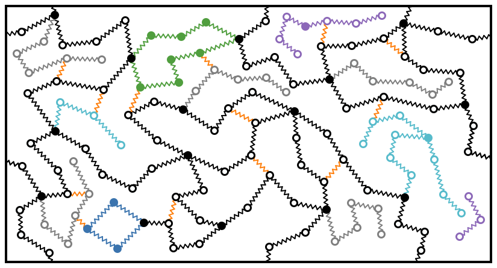

# Polymer Graph Sketcher

Create 2D sketches of Polymers: 
With this software, you can sketch bead-spring networks in 2D.

Example:

## Contents

- [Polymer Graph Sketcher](#polymer-graph-sketcher)
  - [Contents](#contents)
  - [Usage](#usage)
    - [Interface Overview](#interface-overview)
    - [Drawing Modes](#drawing-modes)
    - [Settings](#settings)
      - [Edge Settings](#edge-settings)
      - [Vertex Settings](#vertex-settings)
      - [Canvas Settings](#canvas-settings)
    - [Generators](#generators)
      - [Random Walk Generator](#random-walk-generator)
      - [Side Chain Generator](#side-chain-generator)
    - [Tools](#tools)
    - [Export Options](#export-options)
    - [Movie Recording](#movie-recording)
      - [How to Use](#how-to-use)
  - [Keyboard Shortcuts](#keyboard-shortcuts)
    - [General Actions](#general-actions)
    - [Interaction Modes](#interaction-modes)
  - [Development](#development)
  - [Acknowledgement](#acknowledgement)

## Usage

This app is published here: [polymer-graph-sketcher](https://genietim.github.io/polymer-graph-sketcher/).

It is free to use, but you are asked to cite this repository when you publish images generated with it.

### Interface Overview

The Polymer Graph Sketcher interface consists of a canvas where you draw your polymer graphs, and a control panel with various settings and tools.

Note that you can only select vertices/nodes, and not edges.
Edges are selected by the two connected vertices/nodes.

### Drawing Modes

You can switch between different drawing modes using the dropdown menu or keyboard shortcuts:

- Add vertex (V): Add individual nodes to your graph. For settings, see [Vertex Settings](#vertex-settings)
- Add random walk (R): Generate a chain of connected nodes, see [Random Walk Generator](#random-walk-generator)
- Select vertices (S): Select individual nodes; adds the node you click on to the selection
- Select chains (H): Select entire chains of nodes; selects all nodes connected to the one you click on
- Add edge (E): Connect existing nodes with edges. To adjust these, see [Edge Settings](#edge-settings)
- Delete vertex (D): Remove nodes from the graph. Deletes the nodes you click on.
- Delete edge (L): Remove edges from the graph: deletes the edges between the nodes you select.

### Settings

#### Edge Settings

These settings affect both new as well as edges between the currently selected nodes.

- Edge color: Choose the color for edges
- Line width: Set the thickness of the edges

#### Vertex Settings

These settings affect both new as well as currently selected nodes/vertices.

- Vertex radius: Set the size of the nodes
- Vertex fill color: Choose the interior color of nodes
- Vertex stroke width: Set the thickness of the node outline
- Vertex stroke color: Choose the color for the node outline

#### Canvas Settings

- Canvas width and height: Adjust the size of the drawing area
- Resize elements: Toggle whether elements should resize when the canvas is resized
- Background color: Set the canvas background color
- Border color: Set the color of the box border

### Generators

#### Random Walk Generator

- Step size: Set the distance between nodes in the random walk
- Maximum step angle: Set the maximum angle change between steps
- Number of steps: Set how many nodes to generate in the walk

#### Side Chain Generator

- Side-chain length: Set the length of generated side chains
- Side-chain spawn probability: Set how likely side chains are to spawn
- Side-chain length randomness: Add variability to side chain lengths
- Side-chain angle randomness: Add variability to side chain angles

### Tools

> [!WARNING]  
> Many of these tools are non-reversible, as implemented currently.
> Be sure to export your graph beforehand to have a backup.

- Remove duplicate edges: Eliminate any edges between the same two nodes in the graph
- Remove self-edges: Remove any edges that connect a node to itself
- Force balance step: Adjust node positions to balance forces in the graph, similar to what's documented [here](https://pubs.acs.org/doi/10.1021/acs.macromol.9b01766)
- Position equilibration step: Further refine node positions by moving them away from each other, at most one radius approximately
- Remove bifunctional nodes: Remove nodes that have exactly two connections, merge these two connections to one
- Merge connection by edge color: Combine edges of the same color
- Select vertices with stroke: Select nodes based on their outline color
- Disable PBC: Toggle periodic boundary conditions

### Export Options

- Save as image: Export the graph as a PNG image
- Save as SVG: Export the graph as an SVG file
- Export graph: Save the graph data as a JSON file for later import

These tools and settings allow for the creation of complex polymer graphs, from simple linear chains to branched structures with side chains. The various export options ensure that your work can be saved and used in different formats as needed.

The import of the JSON file is offered at the bottom of the tools.

### Movie Recording

Create animated movies of your graph construction and simulation processes.

The Movie Recording feature allows you to:

1. **Record Edge Additions**: Capture edges as you add them, then generate smooth animations showing the graph being built
2. **Animate Simulations**: Record force balance or position equilibration steps at a controlled speed
3. **Create Combined Movies**: Combine multiple animation types into a single video

#### How to Use

1. Open the "Movie Recording" accordion section in the controls
2. Choose your animation type:
   - **Edge Addition**: Click "Start Recording Edges", add edges in your graph, then "Stop Recording". Adjust duration and create the movie.
   - **Simulation**: Select nodes, configure simulation parameters, and create a simulation movie
   - **Combined**: Create movies with both edge additions and simulation steps
3. Movies are automatically downloaded as WebM video files

## Keyboard Shortcuts

The Polymer Graph Sketcher supports the following keyboard shortcuts for quick access to various functions:

### General Actions

- `Ctrl/Cmd + S`: Save canvas as image and export graph
- `Ctrl/Cmd + Z`: Undo last action
- `Ctrl/Cmd + Shift + Z` or `Ctrl/Cmd + Y`: Redo last undone action
- `A`: Select all nodes
- `C` or `Escape`: Clear selection
- `I`: Invert selection
- `Backspace` or `Delete`: Delete selected nodes

### Interaction Modes

- `D`: Switch to "delete vertex" mode
- `R`: Switch to "random walk" mode
- `L`: Switch to "delete edge" mode
- `S`: Switch to "select vertex" mode
- `H`: Switch to "select chains" mode
- `V`: Switch to "add vertex" (add node) mode
- `E`: Switch to "add edge" mode

These shortcuts provide quick access to common actions and interaction modes, enhancing the efficiency of working with the Polymer Graph Sketcher.

## Development

Steps to code:

1. Clone this repository, e.g. with `git clone git@github.com:GenieTim/polymer-graph-sketcher.git`,
2. Switch the folder to this repository, e.g. with `cd polymer-graph-sketcher`
3. Install the dependencies, e.g. with `npm install`
4. Build and run, e.g. with `npm run dev`

## Acknowledgement

This development of this code was done for projects supported by the Swiss National Science Foundation (SNSF project 200021_204196).
